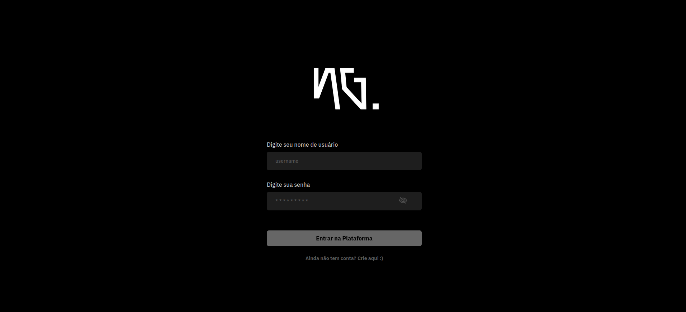
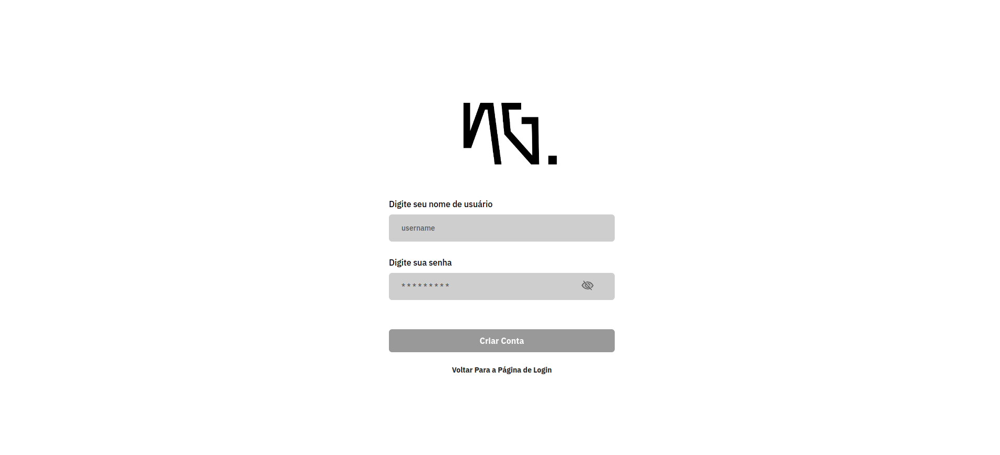
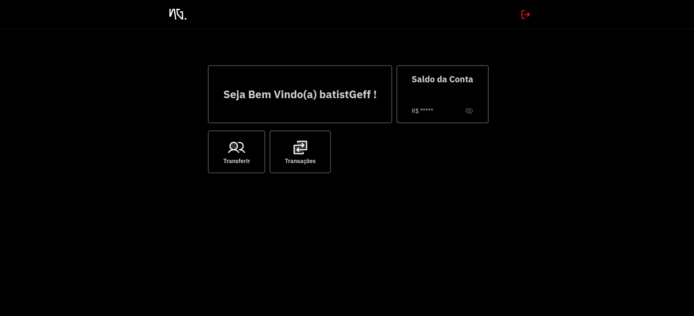
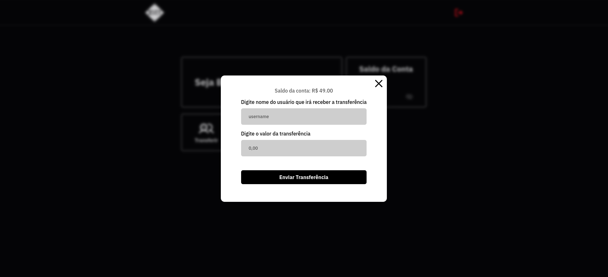
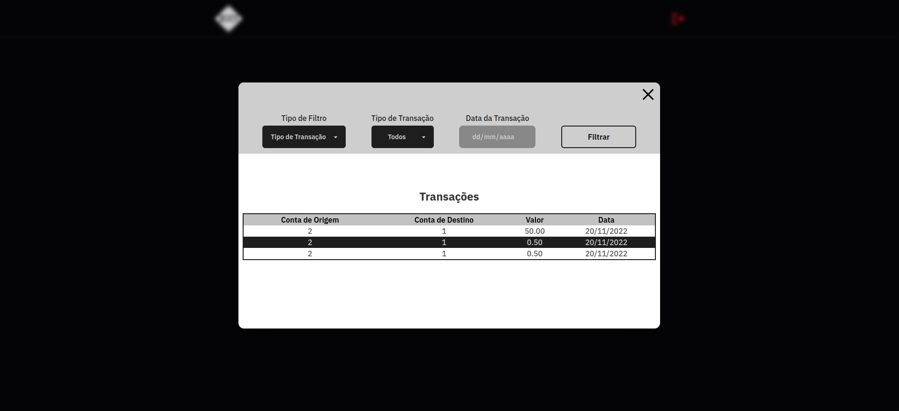

# SEVEN.CASH

<details>
  <summary><strong>🖥️ Telas da Aplicação</strong></summary><br />

  <h3>Tela de Login</h3><br />

  

  <h3>Tela de Registro</h3><br />

  

  <h3>Tela Principal</h3><br />

  

  <h3>Modal para Transferir</h3><br />

  

   <h3>Modal para Visualização de Transferências</h3><br /> 

  

</details>
<br />

# Sobre o Projeto
A Aplicação SEVEN.CASH foi um desafio técnico proposto pela [NG.Cash](https://ng.cash/), onde o objetivo era criar uma aplicação
full-stack, simulando um cenário em que usuários pudessem fazer registro ou login para ter acesso á funcionalidades de transferir 
para outros usuários e terem acesso á todas as transações que participaram. 

## Stack

> Front-end: `HTML/CSS`, `Javascript/Typescript`, `React.js`, `Tailwind CSS`;

> Back-end: `Node.js`, `Express.js`, `Javascript/Typescript`, `Prisma`, `PostgreSQL`;


## Para rodar o projeto localmente:

1 - **Clone o repositório**
```bash
git clone git@github.com:imgeff/seven-cash.git
```

## Executando aplicação
### Requisitos
- [Docker](https://docs.docker.com/desktop/)

Rode a aplicação:

 - Abra um terminal na raiz do projeto
 - Execute o comando `docker-compose up`, o tempo de resolução para esse comando pode variar, mas geralmente na primeira vez 
    em que é executado, leva em torno de 3 a 7 minutos para finalizar o processo.

 - Ao finalizar aparecerá a mensagem **No issues found.** no terminal, e o docker terá subido a aplicação front-end no endereço http://localhost:3000/login

 - E a aplicação back-end no endereço http://localhost:3001/

## Executando os testes

**Front-end:**

 - Abra um terminal na raiz do projeto
 - Execute o comando `npm run test:front`

**Back-end:**

 - Abra um terminal na raiz do projeto
 - Execute o comando `npm run test:back`


